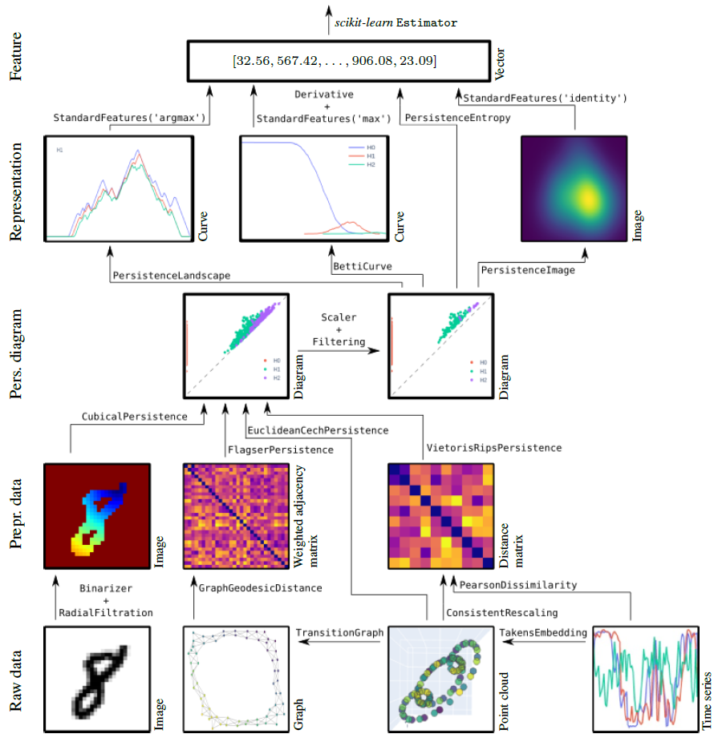

########
Overview
########

**A high-performance topological machine learning toolbox in Python**

``giotto-tda`` is a high performance topological machine learning toolbox in Python built on top of
``scikit-learn`` and is distributed under the GNU AGPLv3 license. It is part of the `Giotto <https://github.com/giotto-ai>`_ family of open-source projects.

.. raw:: html

    

     <iframe src="https://www.youtube.com/embed/hY5TYAq1Rwo" frameborder="0" allow="accelerometer; autoplay; clipboard-write; encrypted-media; gyroscope; picture-in-picture" allowfullscreen style="position: absolute; top: 0; left: 0; width: 100%; height: 100%;"></iframe>
   

.. _guiding_principles:

******************
Guiding principles
******************

 * | **Seamless integration with** ``scikit-learn``
   | Strictly adhere to the ``scikit-learn`` API and development guidelines, inherit the strengths of that framework.
 * | **Code modularity**
   | Topological feature creation steps as transformers. Allow for the creation of a large number of topologically-powered machine learning pipelines.
 * | **Standardisation**
   | Implement the most successful techniques from the literature into a generic framework with a consistent API.
 * | **Innovation**
   | Improve on existing algorithms, and make new ones available in open source.
 * | **Performance**
   | For the most demanding computations, fall back to state-of-the-art C++ implementations, bound efficiently to Python. Vectorized code and implements multi-core parallelism (with ``joblib``).
 * | **Data structures**
   | Support for **tabular data**, **time series**, **graphs**, and **images**.

***************************
30s guide to ``giotto-tda``
***************************

For installation instructions, see :ref:`the installation instructions <installation>`.

The functionalities of ``giotto-tda`` are provided in ``scikit-learn``–style transformers.
This allows you to generate topological features from your data in a familiar way. Here is an example with the :class:`VietorisRipsPersistence` transformer:

.. code-block:: python

  from gtda.homology import VietorisRipsPersistence
  VR = VietorisRipsPersistence()

which computes topological summaries, called :ref:`persistence diagrams <persistence_diagram>`, from collections of :ref:`point clouds <finite_metric_spaces_and_point_clouds>` or weighted graphs, as follows:

.. code-block:: python

  diagrams = VR.fit_transform(point_clouds)

A plotting API allows for quick visual inspection of the outputs of many of ``giotto-tda``'s transformers. To visualize the i-th output sample, run

.. code-block:: python

  diagrams = VR.plot(diagrams, sample=i)

You can create scalar or vector features from persistence diagrams using ``giotto-tda``'s dedicated transformers. Here is an example with the :class:`PersistenceEntropy` transformer:

.. code-block:: python

  from gtda.diagrams import PersistenceEntropy
  PE = PersistenceEntropy()
  features = PE.fit_transform(diagrams)

:obj:`features` is a two-dimensional ``numpy`` array. This is important to making this type of topological feature generation fit into a typical machine learning workflow from ``scikit-learn``.
In particular, topological feature creation steps can be fed to or used alongside models from ``scikit-learn``, creating end-to-end pipelines which can be evaluated in cross-validation,
optimised via grid-searches, etc.:

.. code-block:: python

  from sklearn.ensemble import RandomForestClassifier
  from gtda.pipeline import make_pipeline
  from sklearn.model_selection import train_test_split

  X_train, X_valid, y_train, y_valid = train_test_split(point_clouds, labels)
  RFC = RandomForestClassifier()
  model = make_pipeline(VR, PE, RFC)
  model.fit(X_train, y_train)
  model.score(X_valid, y_valid)

``giotto-tda`` also implements the `Mapper algorithm <https://research.math.osu.edu/tgda/mapperPBG.pdf>`_ as a highly customisable ``scikit-learn`` :class:`Pipeline`, and provides simple plotting functions for visualizing output Mapper graphs and have real-time interaction with the pipeline parameters:

.. code-block:: python

  from gtda.mapper import make_mapper_pipeline
  from sklearn.decomposition import PCA
  from sklearn.cluster import DBSCAN

  pipe = make_mapper_pipeline(filter_func=PCA(), clusterer=DBSCAN())
  plot_interactive_mapper_graph(pipe, data)

*********
Resources
*********

Tutorials and examples
======================

We provide a number of :ref:`tutorials and examples <notebooks_index>`, which offer:

 - quick start guides to the API;
 - in-depth examples showcasing more of the library's features;
 - intuitive explanations of topological techniques.

Use cases
=========

A selection of use cases for ``giotto-tda`` is collected at `this page <https://giotto.ai/use-cases>`_.
Please note, however, that some of these were written for past versions of ``giotto-tda``. In some cases,
only small modifications are needed to run them on recent versions, while in others it is best to install
the relevant past version of ``giotto-tda`` (preferably in a fresh environmnent). In a couple of cases,
the legacy ``giotto-learn`` or ``giotto-learn-nightly`` will be needed.

**********
What's new
**********

.. include::
   release.rst
   :start-after: Release 0.6.0
   :end-before: Release 0.5.1
