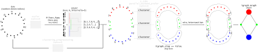

:mod:`gtda.mapper`: Mapper
==========================

.. automodule:: gtda
   :no-members:
   :no-inherited-members:

Filters
-------
.. currentmodule:: gtda

.. autosummary::
   :toctree: generated/mapper/filters
   :template: class.rst

   mapper.Projection
   mapper.Eccentricity
   mapper.Entropy

Covers
-------
.. currentmodule:: gtda

.. autosummary::
   :toctree: generated/mapper/covers
   :template: class.rst

   mapper.OneDimensionalCover
   mapper.CubicalCover

Clustering
----------
.. currentmodule:: gtda

.. autosummary::
   :toctree: generated/mapper/clustering/
   :template: class.rst

   mapper.FirstSimpleGap
   mapper.FirstHistogramGap
   mapper.ParallelClustering

Nerve (graph construction)
--------------------------
.. currentmodule:: gtda

.. autosummary::
   :toctree: generated/mapper/nerve/
   :template: class.rst

   mapper.Nerve

Pipeline
--------
.. currentmodule:: gtda

.. autosummary::
   :toctree: generated/mapper/pipeline/
   :template: function.rst

   mapper.make_mapper_pipeline

.. autosummary::
   :toctree: generated/mapper/pipeline/
   :template: class.rst

   mapper.pipeline.MapperPipeline

Visualization
-------------
.. currentmodule:: gtda

.. autosummary::
   :toctree: generated/mapper/visualization
   :template: function.rst

   mapper.plot_static_mapper_graph
   mapper.plot_interactive_mapper_graph
   mapper.MapperInteractivePlotter

Utilities
---------
.. currentmodule:: gtda

.. autosummary::
   :toctree: generated/mapper/utils
   :template: function.rst

   mapper.method_to_transform
   mapper.transformer_from_callable_on_rows